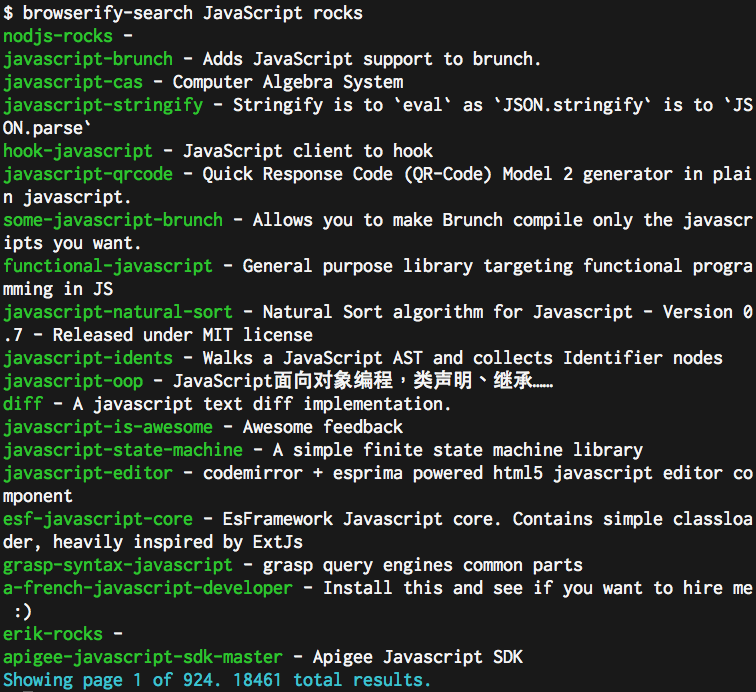

browserify-search
=================

This module makes it convinient to query the [browserifysearch.org](http://browserifysearch.org) service from the commandline or from JavaScript (Node or browser).

## Install

`npm install browserify-search`, with the `-g` flag if you want to install the cli globally on your system.

## CLI

`browserify-search <search terms...>`



See `browserify-search --help` for more.

## JS API

```js
var browserifySearch = require('browserify-search')

browserifySearch('JavaScript rocks', function(err, results){
  console.log('These are the results:', results)
})
```

This function can also take an options object (instead of string) as its first parameter, which contains properties:

* `q` - the query search terms
* `page` - the page offset
* `pageSize` - number of hits per page

The output format is detailed over at the [API docs](https://github.com/browserify-search/www#api---get-apisearch).

